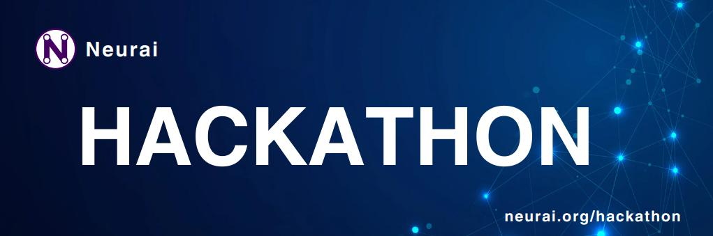

# 
CONNECTED BY CODE 

## What is a hackathon?

A hackathon is a gathering of programmers aimed at collaboratively addressing a challenge or technical problem faced by an organization in record time through their collaborative work. This response typically takes the form of a finished prototype for an innovative product, service, or business model.

We use this event to reward those programmers who first achieve certain objectives. Depending on the difficulty, the prize varies in each case.

## Awards

"All prizes will be offered in Neurai's currency, which is XNA. There will be various valuations depending on complexity

## Participating in a hackathon

Follow this simple guide to sign up for one of our challenges

- Make a fork of the repository.
- Inside the directory of the different targets add a folder with your name and attach the whole development
- Please add a New PR in this repo for your product and leave it open.
- Fill in the following data for the PR with our [template](template.md).
- All code must be MIT
- If code from another project is used, please mention it.
- Please use English for all information and materials.

## Challenges

- [001 walletconnect](001_walletconnect/README.md).

... More Soon